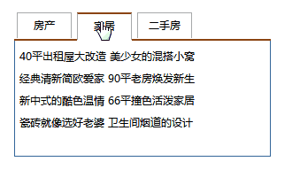
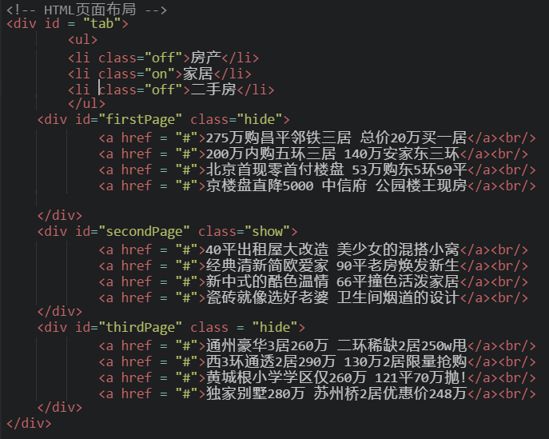
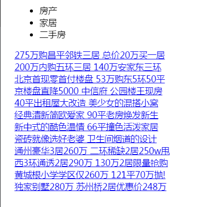
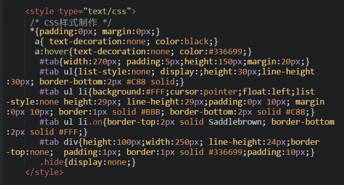
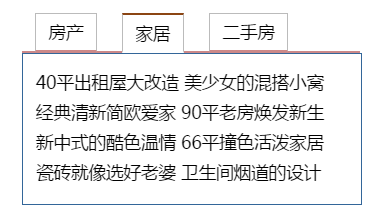
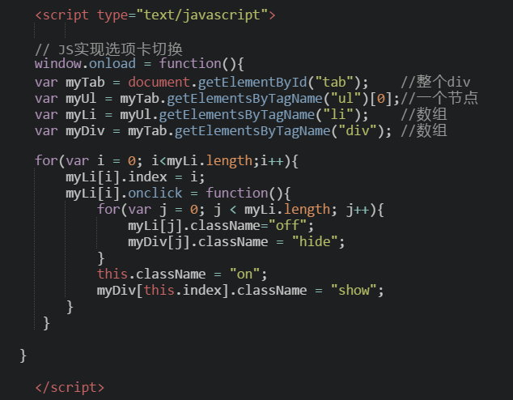

使用之前学过的综合知识，实现一个新闻门户网站上的常见选项卡效果：


<pre>
文字素材:
房产：
    275万购昌平邻铁三居 总价20万买一居
    200万内购五环三居 140万安家东三环
    北京首现零首付楼盘 53万购东5环50平
    京楼盘直降5000 中信府 公园楼王现房
家居:
     40平出租屋大改造 美少女的混搭小窝
     经典清新简欧爱家 90平老房焕发新生
     新中式的酷色温情 66平撞色活泼家居
     瓷砖就像选好老婆 卫生间烟道的设计
二手房：
     通州豪华3居260万 二环稀缺2居250w甩
     西3环通透2居290万 130万2居限量抢购
     黄城根小学学区仅260万 121平70万抛!
     独家别墅280万 苏州桥2居优惠价248万
</pre>

先分析基本思路。首先编写HTML，然后再加载样式，最后用JS修改相应的DOM，达到更改选项卡和内容的目的。

<h2>一、HTML页面布局</h2>
HTML显示的是所有与文字有关的信息，所以在这个页面中与文字有关的信息为上面选项卡的<b>三个标题</b>，以及<b>选项卡的内容</b>。
于是决定标题使用`<ul> <li>`布局，内容使用`<div>`布局。编写代码如下：


现在展示出来的样式是这样的：



<h2>CSS样式</h2>
要制作成上图所示的选项卡样式，几个地方需要注意：
1、整个选项卡的样式设置
2、选项卡标题的样式设置
3、选项卡内容的样式设置
4、只能显示一个选项卡的内容，其他选项卡内容隐藏。



写完以后，效果就出来啦。



<h2>JavaScript实现选项卡切换</h2>
1、首先需要获取选项卡标题和选项卡内容
2、选项卡内容有三个，需要循环遍历来操作，得知哪个选项卡和哪个选项内容匹配。
3、通过改变DOM的css类名称,当前点击的选项卡显示，其它隐藏。


完整代码：

```
<!DOCTYPE html>
<html>
<head lang="en">
    <meta charset="UTF-8">
    <title> 选项卡</title>
<style type="text/css">
/* CSS样式制作 */  
 *{padding:0px; margin:0px;}
  a{ text-decoration:none; color:black;}
  a:hover{text-decoration:none; color:#336699;}
   #tab{width:270px; padding:5px;height:150px;margin:20px;}
   #tab ul{list-style:none; display:;height:30px;line-height:30px;
        border-bottom:2px #C88 solid;}
   #tab ul li{background:#FFF;cursor:pointer;float:left;
    list-style:none height:29px; line-height:29px;padding:0px 10px;
    margin:0px 10px; border:1px solid #BBB; border-bottom:2px solid #C88;}
   #tab ul li.on{border-top:2px solid gray; border-bottom:2px solid #FFF;}
   #tab div{height:100px;width:250px; line-height:24px;border-top:none;  
            padding:1px; border:1px solid #336699;padding:10px;}
   .hide{display:none;}
</style>

    <script type="text/javascript">
    // JS实现选项卡切换
    window.onload = function(){
    var myTab = document.getElementById("tab");    //整个div
    var myUl = myTab.getElementsByTagName("ul")[0];//一个节点
    var myLi = myUl.getElementsByTagName("li");    //数组
    var myDiv = myTab.getElementsByTagName("div"); //数组

    for(var i = 0; i<myLi.length;i++){
        myLi[i].index = i;
        myLi[i].onclick = function(){
            for(var j = 0; j < myLi.length; j++){
                myLi[j].className="off";
                myDiv[j].className = "hide";
            }
            this.className = "on";
            myDiv[this.index].className = "show";
        }
      }
    }
    </script>
</head>
<body>
<!-- HTML页面布局 -->
<div id = "tab">
        <ul>
        <li class="off">房产</li>
        <li class="on">家居</li>
        <li class="off">二手房</li>
        </ul>
    <div id="firstPage" class="hide">
            <a href = "#">275万购昌平邻铁三居 总价20万买一居</a><br/>
            <a href = "#">200万内购五环三居 140万安家东三环</a><br/>
            <a href = "#">北京首现零首付楼盘 53万购东5环50平</a><br/>
            <a href = "#">京楼盘直降5000 中信府 公园楼王现房</a><br/>
    </div>
    <div id="secondPage" class="show">
            <a href = "#">40平出租屋大改造 美少女的混搭小窝</a><br/>
            <a href = "#">经典清新简欧爱家 90平老房焕发新生</a><br/>
            <a href = "#">新中式的酷色温情 66平撞色活泼家居</a><br/>
            <a href = "#">瓷砖就像选好老婆 卫生间烟道的设计</a><br/>
    </div>
    <div id="thirdPage" class = "hide">
            <a href = "#">通州豪华3居260万 二环稀缺2居250w甩</a><br/>
            <a href = "#">西3环通透2居290万 130万2居限量抢购</a><br/>
            <a href = "#">黄城根小学学区仅260万 121平70万抛!</a><br/>
            <a href = "#">独家别墅280万 苏州桥2居优惠价248万</a><br/>
    </div>
</div>
</body>
</html>
```
